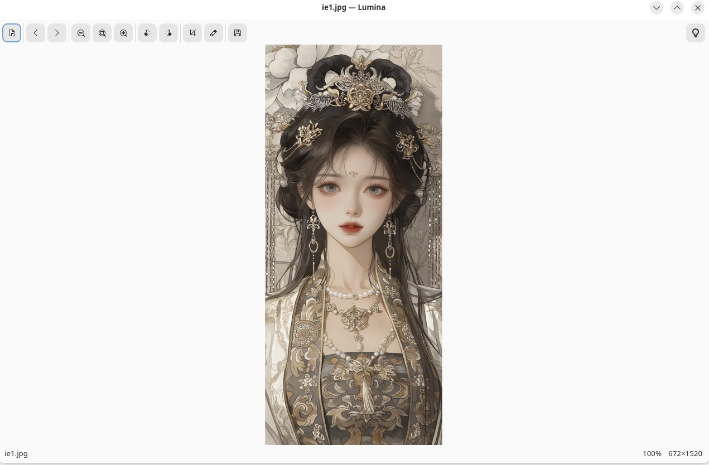
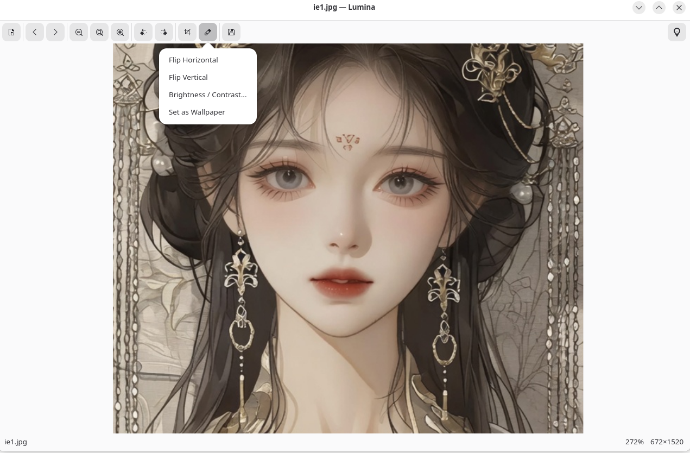

# Lumina Photo Viewer

<p align="center">
  
</p>

<p align="center">
  <b>A modern, official-grade photo viewer for Linux</b><br>
  Built with GTK4 & libadwaita — smooth, fast, and touchpad-friendly
</p>

<p align="center">
  
  
  
</p>

---

## Features

| Feature | Description |
|---------|-------------|
| **Two-Finger Pinch Zoom** | Spread to zoom in, pinch to zoom out — native touchpad gesture |
| **Smooth Panning** | Click and drag to pan when zoomed, with kinetic scrolling |
| **Visual Crop Tool** | Drag to select, rule-of-thirds guides, corner handles |
| **Rotate & Flip** | Left/right rotation, horizontal/vertical flip |
| **Brightness & Contrast** | Live adjustment sliders |
| **Set as Wallpaper** | One-click desktop background |
| **Folder Navigation** | Arrow keys to browse all images in the folder |
| **Drag & Drop** | Drop any image directly into the window |

## Supported Formats

`JPEG` `JPG` `PNG` `WebP` `BMP` `TIFF` `GIF` `SVG`

---

## Installation

### Fedora

```bash
# Install dependencies
sudo dnf install python3-gobject python3-cairo gtk4 libadwaita gdk-pixbuf2-loader-webp

# Clone and install
git clone https://github.com/abirmehmed/lumina-photo-viewer.git
cd lumina-photo-viewer
sudo bash install.sh
```

### Ubuntu / Debian

```bash
sudo apt install python3-gi python3-cairo gir1.2-gtk-4.0 gir1.2-adw-1
git clone https://github.com/abirmehmed/lumina-photo-viewer.git
cd lumina-photo-viewer
sudo bash install.sh
```

### Arch Linux

```bash
sudo pacman -S python-gobject gtk4 libadwaita
git clone https://github.com/abirmehmed/lumina-photo-viewer.git
cd lumina-photo-viewer
sudo bash install.sh
```

---

## Usage

```bash
# Open a specific image
lumina ~/Pictures/photo.jpg

# Or just launch Lumina and open from the UI
lumina
```

---

## Keyboard Shortcuts

| Shortcut | Action |
|----------|--------|
| `Ctrl + O` | Open image |
| `Ctrl + Shift + S` | Save as |
| `Ctrl + +` | Zoom in |
| `Ctrl + -` | Zoom out |
| `Ctrl + 0` | Fit to window |
| `Ctrl + L` | Rotate left |
| `Ctrl + R` | Rotate right |
| `Ctrl + Shift + C` | Crop tool |
| `← / →` | Previous / Next image |
| `I` | Image info |
| `Esc` | Exit crop mode |

## Touchpad Gestures

| Gesture | Action |
|---------|--------|
| **Two-finger pinch** | Zoom in / out |
| **Two-finger spread** | Zoom in |
| **Click + drag** | Pan (when zoomed) |

---

## Set as Default Photo Viewer

### Method 1: Right-click
Right-click any image → **Open With Other Application** → **Lumina** → **Set as default**

### Method 2: Command line
```bash
xdg-mime default com.lumina.PhotoViewer.desktop image/jpeg image/png image/webp image/gif image/bmp image/tiff
```

---

## Screenshots

<p align="center">
  
  <br><br>
  
</p>

---

## Tech Stack

- **GTK4** — Modern native Linux UI
- **libadwaita** — Adaptive, responsive design
- **GdkPixbuf** — Image loading and manipulation
- **Python 3** — Clean, maintainable codebase
- **Cairo** — Hardware-accelerated rendering

---

## Contributing

Contributions are welcome! Feel free to open an issue or submit a pull request.

1. Fork the repository
2. Create a feature branch (`git checkout -b feature/amazing-feature`)
3. Commit your changes (`git commit -m 'Add amazing feature'`)
4. Push to the branch (`git push origin feature/amazing-feature`)
5. Open a Pull Request

---

## License

Distributed under the MIT License. See [LICENSE](LICENSE) for details.

---

<p align="center">
  Made with ❤️ for the Linux community
</p>
